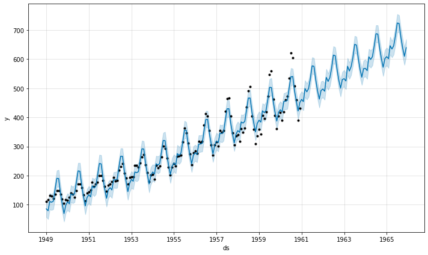
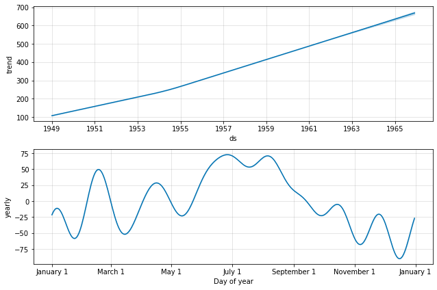
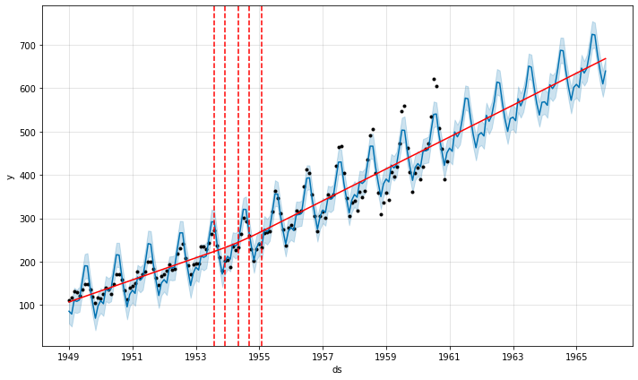

# Time-Series-Analysis-and-Forecasting-of-Air-Passengers
Using Facebook Prophet to forecast the number of air passengers in USA for 5 years(1961 to 1965) using the known data from January 1949 to December 1960. Open [Notebook](https://github.com/rahulhegde99/Time-Series-Analysis-and-Forecasting-of-Air-Passengers/blob/master/Forecasting_AirPassengers.ipynb) for more information.

### Illustrations
The below image shows the basic prediction. The light blue is the uncertainty level(yhat upper and yhat lower), the dark blue is the prediction(yhat) and the block dots are the original data. The data is predicted for the 5 more years.

The below image shows the trends and seasonality of the time series data.

The beow image shows the prediction, trend and also the changepoint in the trends.

